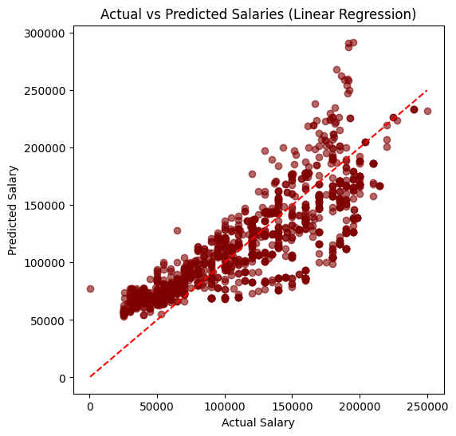

# 💼 Salary Prediction using Regression Models  

## 📊 Overview
This project focuses on predicting **employee salaries** based on various features such as **Age, Gender, Education Level, Job Title, and Years of Experience**.  
Two regression models were used to understand the relationship between these variables and salary levels:

- **Linear Regression**
- **Polynomial Regression (for capturing non-linear patterns)**

---

## ⚙️ Project Workflow
1. **Data Cleaning:**  
   - Handled missing values using median imputation.  
   - Encoded categorical variables (`Gender`, `Education Level`, `Job Title`).

2. **Feature Selection:**  
   - Selected: `Years of Experience`, `Age`, `Gender`, `Education Level`, `Job Title`.  
   - Target: `Salary`.

3. **Model Training:**  
   - Split data into training and testing sets (80/20).  
   - Trained both Linear and Polynomial regression models.

4. **Model Evaluation:**  
   - Compared both models using **R²** and **MAE** metrics.  

---

## 📈 Results

| Model | R² Score | MAE |
|--------|-----------|-----------|
| Linear Regression | 0.671 | 24,559 |
| Polynomial Regression | **0.863** | **14,957** |

The **Polynomial Regression model** performed significantly better, indicating the presence of **non-linear relationships** in the data.

---

## 📷 Visualization
The plot below shows the comparison between **Actual vs Predicted Salaries** using the Linear Regression model.

---

## 👨‍💻 Tech Stack
- Python 🐍  
- Pandas  
- NumPy  
- Matplotlib  
- Scikit-learn  

---

## 🏁 Conclusion
The project demonstrates how **experience, education, and job title** play key roles in determining salary.  
Polynomial regression proved more effective in capturing complex salary patterns compared to the simple linear approach.

---

## scroll for Arabic 👇
---

# 💼 التنبؤ بالرواتب باستخدام نماذج الانحدار  

## 📊 نظرة عامة
يهدف هذا المشروع إلى **توقع رواتب الموظفين** بناءً على مجموعة من العوامل مثل:  
**العمر، الجنس، المستوى التعليمي، المسمى الوظيفي، وعدد سنوات الخبرة.**

تم استخدام نموذجين من الانحدار لتحليل البيانات:
- **Linear Regression**
- **Polynomial Regression** لاكتشاف الأنماط غير الخطية في البيانات.

---

## ⚙️ خطوات المشروع
1. **تنظيف البيانات:**  
   - معالجة القيم المفقودة باستخدام الوسيط.  
   - تحويل المتغيرات النصية إلى رقمية (مثل الجنس والمستوى التعليمي والمسمى الوظيفي).

2. **اختيار العوامل:**  
   - المتغيرات المدخلة: `Years of Experience`, `Age`, `Gender`, `Education Level`, `Job Title`.  
   - المتغير المستهدف: `Salary`.

3. **تدريب النماذج:**  
   - تقسيم البيانات إلى تدريب واختبار بنسبة 80/20.  
   - تدريب النموذجين (Linear وPolynomial Regression).

4. **تقييم الأداء:**  
   - باستخدام مقاييس **R²** و **MAE**.

---

## 📈 النتائج

| النموذج | R² | MAE |
|----------|----------|----------|
| Linear Regression | 0.671 | 24,559 |
| Polynomial Regression | **0.863** | **14,957** |

يتضح أن نموذج **Polynomial Regression** حقق أداءً أفضل، مما يشير إلى وجود علاقات غير خطية بين العوامل والراتب.

---

## 📷 التصور البياني
الصورة التالية توضح العلاقة بين **الرواتب الفعلية والمتوقعة** باستخدام نموذج الانحدار الخطي.

---

## 👨‍💻 الأدوات المستخدمة
- Python 🐍  
- Pandas  
- NumPy  
- Matplotlib  
- Scikit-learn  

---

## 🏁 الخلاصة
المشروع يوضح كيف أن **الخبرة، التعليم، والمسمى الوظيفي** عوامل رئيسية في تحديد الرواتب،  
كما أن **Polynomial Regression** كان أكثر دقة في اكتشاف العلاقات المعقدة بين العوامل المختلفة.
